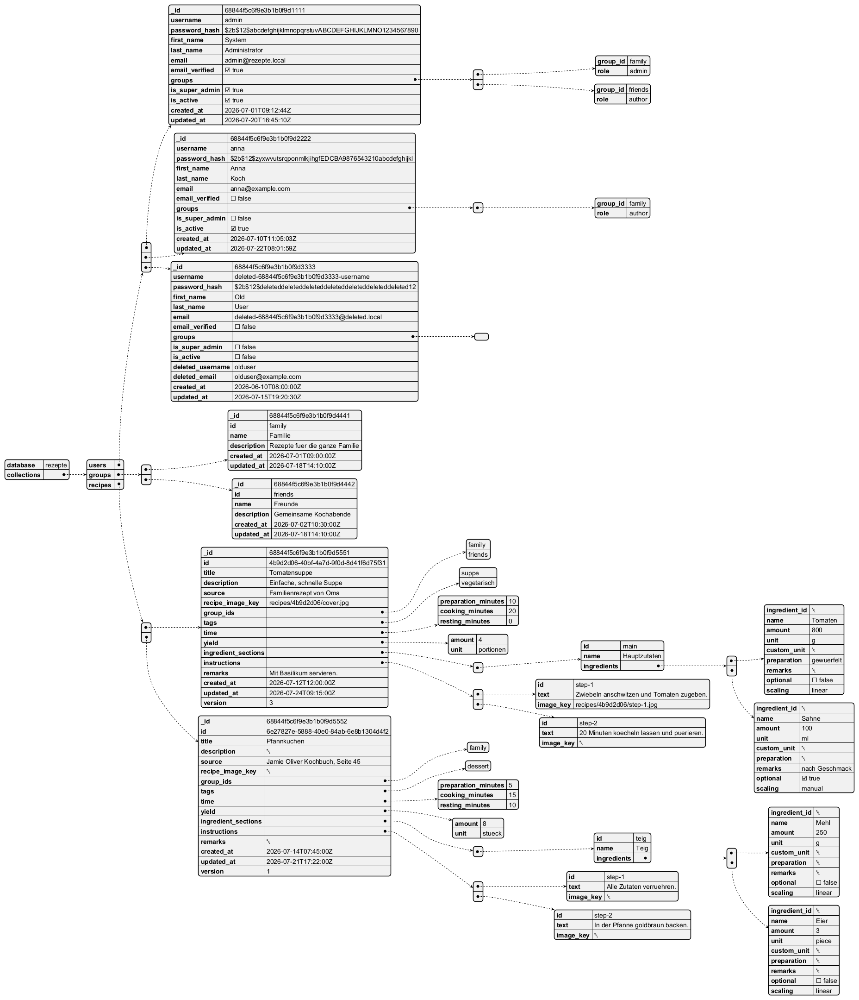

# Database structure

_Rezepte_ is using a mongo db (see [https://en.wikipedia.org/wiki/MongoDB]).

## Database structure

Used data base structure can be described in following json

```json
{
  "database": "rezepte",
  "collections": [
    {
      "name": "users",
      "documentShape": {
        "_id": "ObjectId",
        "username": "string",
        "password_hash": "string",
        "first_name": "string",
        "last_name": "string",
        "email": "string",
        "email_verified": "boolean",
        "groups": [
          {
            "group_id": "string",
            "role": "enum(admin|author|reader)"
          }
        ],
        "is_super_admin": "boolean",
        "is_active": "boolean",
        "created_at": "datetime",
        "updated_at": "datetime",
        "deleted_username": "string (optional, soft-delete)",
        "deleted_email": "string (optional, soft-delete)"
      },
      "indexes": [
        {
          "name": "uniq_active_username",
          "keys": ["username"],
          "unique": true,
          "partialFilterExpression": {
            "is_active": true
          }
        },
        {
          "name": "uniq_active_email",
          "keys": ["email"],
          "unique": true,
          "partialFilterExpression": {
            "is_active": true
          }
        }
      ],
      "relations": [
        {
          "field": "groups.group_id",
          "references": "groups.id",
          "type": "many-to-many via embedded role entries"
        }
      ]
    },
    {
      "name": "groups",
      "documentShape": {
        "_id": "ObjectId",
        "id": "string (business key)",
        "name": "string",
        "description": "string|null",
        "created_at": "datetime",
        "updated_at": "datetime"
      },
      "indexes": [
        {
          "name": "id_1",
          "keys": ["id"],
          "unique": true
        }
      ],
      "relations": [
        {
          "referencedBy": "users.groups.group_id"
        },
        {
          "referencedBy": "recipes.group_ids[]"
        }
      ]
    },
    {
      "name": "recipes",
      "documentShape": {
        "_id": "ObjectId",
        "id": "string (uuid)",
        "title": "string",
        "description": "string|null",
        "source": "string|null",
        "recipe_image_key": "string|null",
        "group_ids": ["string"],
        "tags": ["string"],
        "time": {
          "preparation_minutes": "int|null",
          "cooking_minutes": "int|null",
          "resting_minutes": "int|null"
        },
        "yield": {
          "amount": "decimal",
          "unit": "string"
        },
        "ingredient_sections": [
          {
            "id": "string",
            "name": "string|null",
            "ingredients": [
              {
                "ingredient_id": "string|null",
                "name": "string",
                "amount": "decimal|null",
                "unit": "enum(g|kg|ml|l|tsp|tbsp|piece|pinch|bunch|clove|slice|cup|as_needed|custom)",
                "custom_unit": "string|null",
                "preparation": "string|null",
                "remarks": "string|null",
                "optional": "boolean",
                "scaling": "enum(linear|manual|none)"
              }
            ]
          }
        ],
        "instructions": [
          {
            "id": "string",
            "text": "string",
            "image_key": "string|null"
          }
        ],
        "remarks": "string|null",
        "created_at": "datetime",
        "updated_at": "datetime",
        "version": "int (optimistic locking)"
      },
      "indexes": [],
      "relations": [
        {
          "field": "group_ids[]",
          "references": "groups.id",
          "type": "many-to-many (array reference)"
        }
      ]
    }
  ],
  "crossCollectionRules": [
    "Deleting a group removes references from users.groups and recipes.group_ids",
    "Recipes with empty group_ids after group removal are deleted",
    "Users are soft-deleted by setting is_active=false and tombstoning username/email"
  ]
}
```

## Example

A short overview about data strcuture is provided by folloning image which represents
data sructure filled with example data.


