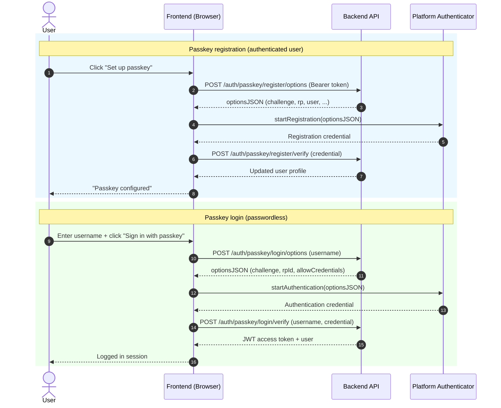

# Passkey Authentication (WebAuthn)

This document describes how passkey authentication is implemented in this
project, how to configure it, and how to use the API endpoints.

## Overview

The backend supports two login methods:

- Username + password (`/auth/login`)
- Passkey login via WebAuthn (`/auth/passkey/login/*`)

Passkeys are registered by an authenticated user and then can be used for passwordless login.

## Backend Configuration

Passkey settings are defined in [backend/src/app/core/settings.py](../backend/src/app/core/settings.py):

- `webauthn_rp_id`: Relying Party ID, usually your domain (for local development often `localhost`)
- `webauthn_rp_name`: Human-readable Relying Party name shown by authenticators
- `webauthn_origin`: Allowed frontend origin for WebAuthn assertions
- `webauthn_require_user_verification`: Require biometric/PIN verification when `true`

### Recommended values

Local development example:

- `webauthn_rp_id=localhost`
- `webauthn_origin=http://localhost:5173`

Production example:

- `webauthn_rp_id=rezepte.unbenet.de`
- `webauthn_origin=https://rezepte.unbenet.de`

Important:

- `webauthn_rp_id` must match the effective domain rules expected by the browser/authenticator.
- `webauthn_origin` must exactly match the frontend origin.
- Browser passkeys require HTTPS in production.

## Docker Environment Configuration

`webauthn_rp_id` is read from the environment variable `WEBAUTHN_RP_ID`.
This allows different values for test and production deployments.

Configured Docker overlays:

- Test: [docker/docker-compose.test.yml](../docker/docker-compose.test.yml)
  - `WEBAUTHN_RP_ID: ${WEBAUTHN_RP_ID:-localhost}`
- Production: [docker/docker-compose.prod.yml](../docker/docker-compose.prod.yml)
  - `WEBAUTHN_RP_ID: ${WEBAUTHN_RP_ID:-rezepte.unbenet.de}`

Notes:

- You can override the defaults at deployment time by providing
  `WEBAUTHN_RP_ID` in your environment or env files.
- Keep `WEBAUTHN_RP_ID` and `WEBAUTHN_ORIGIN` aligned with the real public
  host and origin used by the browser.

## Dependencies

Backend dependency:

- `webauthn`

Frontend dependency:

- `@simplewebauthn/browser`

## API Endpoints

Base URL: `http://<server>/api`

### 1. Register Passkey: Request Options

```http
POST /auth/passkey/register/options
Authorization: Bearer <ACCESS_TOKEN>
```

Response `200`:

```json
{
  "options": {
    "challenge": "...",
    "rp": { "id": "localhost", "name": "UnbenetRezepte" },
    "user": { "id": "...", "name": "admin", "displayName": "System Administrator" }
  }
}
```

### 2. Register Passkey: Verify Credential

```http
POST /auth/passkey/register/verify
Authorization: Bearer <ACCESS_TOKEN>
Content-Type: application/json
```

Request body:

```json
{
  "credential": { "id": "...", "rawId": "...", "response": { "...": "..." }, "type": "public-key" },
  "credential_name": "MacBook Touch ID"
}
```

Response `200`: updated `UserPublic` object.

### 3. Passkey Login: Request Options

```http
POST /auth/passkey/login/options
Content-Type: application/json
```

Request body:

```json
{
  "username": "admin"
}
```

Response `200`:

```json
{
  "options": {
    "challenge": "...",
    "rpId": "localhost",
    "allowCredentials": [{ "id": "...", "type": "public-key" }]
  }
}
```

### 4. Passkey Login: Verify Credential

```http
POST /auth/passkey/login/verify
Content-Type: application/json
```

Request body:

```json
{
  "username": "admin",
  "credential": { "id": "...", "rawId": "...", "response": { "...": "..." }, "type": "public-key" }
}
```

Response `200`:

```json
{
  "access_token": "<JWT_TOKEN>",
  "token_type": "bearer",
  "user": {
    "id": "...",
    "username": "admin",
    "first_name": "System",
    "last_name": "Administrator",
    "email": "admin@example.com",
    "email_verified": true,
    "groups": [],
    "is_super_admin": true,
    "is_active": true
  }
}
```

## Frontend Flow

The frontend uses `@simplewebauthn/browser`:

- `startRegistration()` after `/auth/passkey/register/options`
- `startAuthentication()` after `/auth/passkey/login/options`

Implemented in:

- [frontend/src/auth/AuthContext.tsx](../frontend/src/auth/AuthContext.tsx)
- [frontend/src/components/LoginPanel.tsx](../frontend/src/components/LoginPanel.tsx)
- [frontend/src/components/SectionUserInfo.tsx](../frontend/src/components/SectionUserInfo.tsx)

## MSC (Message Sequence Chart)

The following sequence diagram sketches both main passkey flows.



## Troubleshooting

- `No passkey registered for this user`: register at least one passkey first.
- `No passkey authentication in progress`: call `/auth/passkey/login/options` before verify.
- `Passkey registration failed` or `Passkey authentication failed`: verify
  `webauthn_rp_id` and `webauthn_origin` match your actual environment.
- Browser/security issues in production: ensure HTTPS and correct domain.
